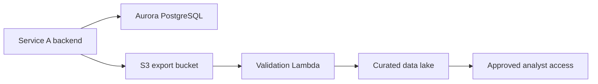

# Service A High-Level Data Flow



## Metadata

```yaml
layer: data-flow
scope: high-level data movement
owner_team: Platform Services and Data Platform
architecture_source: service-a-data-flow-architecture.drawio
updated_at: "2026-06-08"
```
