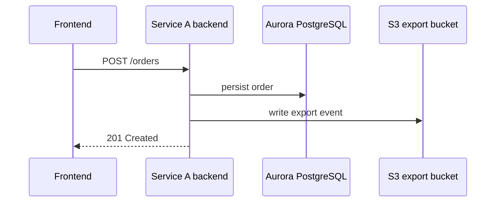

# Service A API Flow


```mermaid
sequenceDiagram
  participant UI as Frontend
  participant API as Service A backend
  participant DB as Aurora PostgreSQL
  participant S3 as S3 export bucket

  UI->>API: POST /orders
  API->>DB: persist order
  API->>S3: write export event
  API-->>UI: 201 Created
```

## Metadata

```yaml
layer: unit
scope: single service module
owner_team: Platform Services
source_service: Service A backend
updated_at: "2026-06-08"
```
