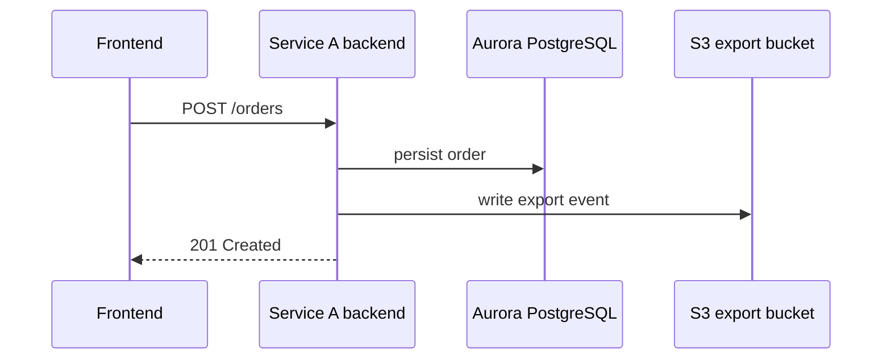

# Service Hosting Account A

  

    <strong>Account Structurizr preview</strong>
    
      <a class="button" href="{{ '/architecture/01-account/service-hosting-account-a-network.dsl' | relative_url }}">Download DSL</a>
      <a class="button" href="{{ '/architecture/01-account/service-hosting-account-a-network.svg' | relative_url }}">Open preview</a>
    
  

  

  

    <strong>Network infrastructure draw.io preview</strong>
    
      <a class="button" href="{{ '/architecture/02-network/service-hosting-account-a-network-infra.drawio' | relative_url }}">Download draw.io</a>
      <a class="button" href="{{ '/docs/network/service-hosting-account-a-network.html' | relative_url }}">Open page</a>
    
  

  

  

    <strong>Overall service and data-flow draw.io preview</strong>
    
      <a class="button" href="{{ '/architecture/03-service-dataflow/overall-service-dataflow.drawio' | relative_url }}">Download draw.io</a>
      <a class="button" href="{{ '/docs/service-dataflow/overall-service-dataflow.html' | relative_url }}">Open page</a>
    
  

  

  

    <strong>Unit service API Mermaid preview</strong>
    
      <a class="button" href="{{ '/architecture/04-unit/service-a-api-flow.md' | relative_url }}">Download Mermaid</a>
      <a class="button" href="{{ '/docs/units/service-a-api-flow.html' | relative_url }}">Open page</a>
    
  

  

    <strong>Observability draw.io preview</strong>
    
      <a class="button" href="{{ '/architecture/05-observability/observability-architecture.drawio' | relative_url }}">Download draw.io</a>
      <a class="button" href="{{ '/docs/observability/observability-architecture.html' | relative_url }}">Open page</a>
    
  

  

## Metadata

| Field | Value |
| --- | --- |
| Owner team | Platform Services |
| Account ID | `111111111111` |
| Environment | Production |
| Region | `ap-northeast-1` |
| Related GitHub repo | `https://github.com/example/service-a` |
| CDK repo | `https://github.com/example/service-a-cdk` |
| Datadog dashboard | `https://app.datadoghq.com/dashboard/example-service-a` |
| Runbook | `https://github.com/example/runbooks/service-a.md` |
| Confluence | `https://confluence.example.com/display/CLOUD/Service+A` |
| Management model | CDK-managed |
| Updated | 2026-06-08 |

## Key Scope

| Area | Contents |
| --- | --- |
| Region | `ap-northeast-1` |
| VPC | `vpc-service-a-prod` |
| Network layer | Account -> region -> VPC -> AZ -> subnet -> IP capacity -> IGW/router/route tables -> VPC peering/endpoints |
| Service/data-flow layer | Hosted services -> AWS services -> feature realization -> cross-account data movement |
| Unit layer | Single service/module API call path |
| Observability layer | Logs, metrics, traces, dashboards, alerts, runbooks |

## Architecture Layers

  <a class="layer-card" href="{{ '/docs/network/service-hosting-account-a-network.html' | relative_url }}"><strong>Network infrastructure</strong><small>draw.io preview</small></a>
  <a class="layer-card" href="{{ '/docs/service-dataflow/overall-service-dataflow.html' | relative_url }}"><strong>Overall service/data-flow</strong><small>draw.io preview</small></a>
  <a class="layer-card" href="{{ '/docs/units/service-a-api-flow.html' | relative_url }}"><strong>Unit/API flow</strong><small>Mermaid preview for one service module</small></a>
  <a class="layer-card" href="{{ '/docs/observability/observability-architecture.html' | relative_url }}"><strong>Observability</strong><small>draw.io preview</small></a>

## Source Files

- Account layer: [`../../architecture/01-account/service-hosting-account-a-network.dsl`](../../architecture/01-account/service-hosting-account-a-network.dsl)
- Network layer: [`../../architecture/02-network/service-hosting-account-a-network-infra.drawio`](../../architecture/02-network/service-hosting-account-a-network-infra.drawio)
- Service/data-flow layer: [`../../architecture/03-service-dataflow/overall-service-dataflow.drawio`](../../architecture/03-service-dataflow/overall-service-dataflow.drawio)
- Unit/API layer: [`../../architecture/04-unit/service-a-api-flow.html`](../../architecture/04-unit/service-a-api-flow.html)
- Observability layer: [`../../architecture/05-observability/observability-architecture.drawio`](../../architecture/05-observability/observability-architecture.drawio)
