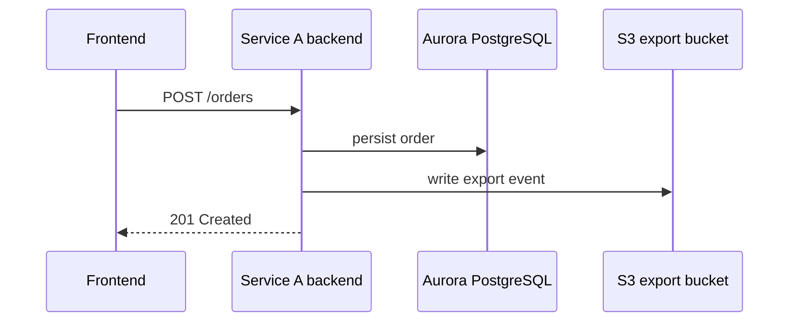

# Service A API Flow

## Scope

| Field | Value |
| --- | --- |
| Layer | Unit/API |
| Focus | Single microservice/module flow |
| Owner | Platform Services |
| Source file | `architecture/04-unit/service-a-api-flow.md` |

## Source

[Open source Mermaid page]({{ '/architecture/04-unit/service-a-api-flow.html' | relative_url }})
