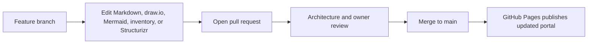

# Architecture Update Rule

Architecture documentation changes follow the same review model as code.



## Required Update Pattern

| Change type | Files normally touched |
| --- | --- |
| New account | `inventory/accounts.yaml`, `docs/account-overview.md`, `docs/accounts/*.md`, `structurizr/accounts.dsl` |
| VPC/resource change | `diagrams/network/*.drawio`, `diagrams/resources/*.drawio`, account detail page |
| Service communication change | `flows/*communication.md`, account detail page |
| Data path change | `flows/*data-flow.md`, `inventory/data-stores.yaml`, account detail page |
| Ownership change | `inventory/accounts.yaml`, `structurizr/ownership.dsl`, `docs/ownership-overview.md` |
| Dashboard/runbook change | Account metadata block and related link sections |

## Branch Naming Examples

```text
docs/account-a-new-private-endpoint
docs/service-a-observability-flow
docs/data-analysis-s3-access-pattern
```

