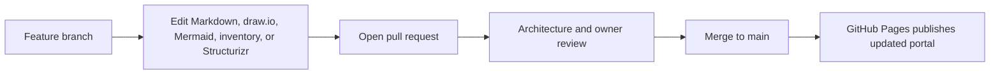

# Architecture Update Rule

Architecture documentation changes follow the same review model as code.



## Required Update Pattern

| Change type | Files normally touched |
| --- | --- |
| New account | `inventory/accounts.yaml`, `docs/account-overview.md`, `architecture/01-account/*.dsl`, account page |
| Account/network change | `architecture/01-account/*.dsl`, preview SVG, account page |
| Service communication/resource change | `architecture/02-service/*.drawio`, preview SVG, service page |
| Isolated data-flow architecture change | `architecture/03-data-flow/*.drawio`, preview SVG, data-flow page |
| Unit/API flow change | `architecture/04-unit/*.md`, unit page |
| Ownership change | `inventory/accounts.yaml`, `structurizr/ownership.dsl`, `docs/ownership-overview.md` |
| Dashboard/runbook change | Account metadata block and related link sections |

## Branch Naming Examples

```text
docs/account-a-new-private-endpoint
docs/service-a-observability-flow
docs/data-analysis-s3-access-pattern
```
