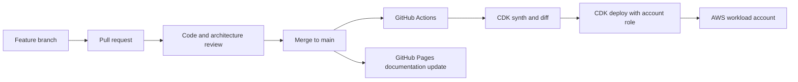

# CI/CD Flow

This optional Mermaid page shows how GitHub and CDK updates move into AWS accounts.



## Metadata

```yaml
owner_team: Cloud Platform
cdk_repo: https://github.com/example/shared-engineering-cdk
documentation_repo: https://github.com/example/team-aws-architecture
management_model: GitHub PR plus CDK-managed infrastructure
updated_at: "2026-06-08"
```

