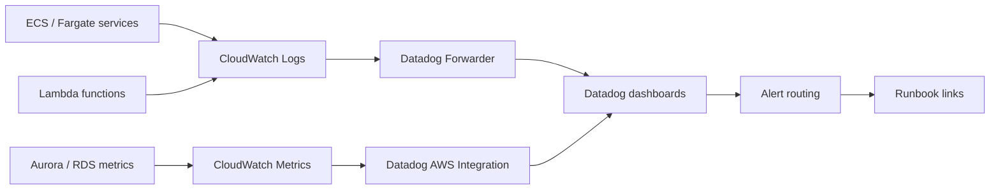

# Observability Flow

This page shows the shared logical path for logs, metrics, traces, dashboards, and runbooks.

Related shared account page: [`../docs/accounts/shared-engineering-account.md`](../docs/accounts/shared-engineering-account.md)



## Metadata

```yaml
owner_team: Cloud Platform
accounts:
  - "111111111111"
  - "222222222222"
  - "555555555555"
dashboard: https://app.datadoghq.com/dashboard/example-shared-engineering
runbook: https://github.com/example/runbooks/observability.md
updated_at: "2026-06-08"
```

