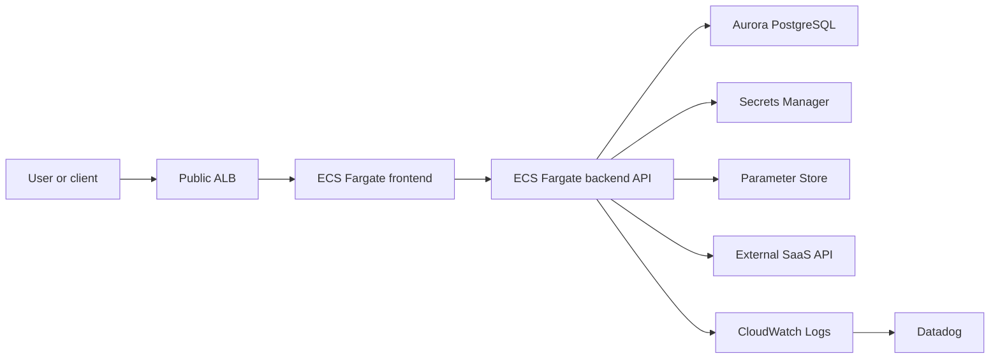

# Service A Communication Flow

This Mermaid page explains the logical request path for Service A. Detailed networking remains in the draw.io architecture diagram.

Related account page: [`../docs/accounts/service-hosting-account-a.md`](../docs/accounts/service-hosting-account-a.md)



## Metadata

```yaml
owner_team: Platform Services
account_id: "111111111111"
environment: production
region: ap-northeast-1
source_diagram: ../diagrams/network/service-hosting-account-a.drawio
management_model: CDK-managed
updated_at: "2026-06-08"
```

