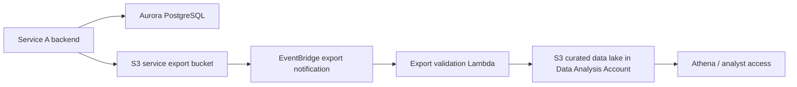

# Service A Data Flow

This page shows how Service A reads and writes its primary data and how curated exports reach the Data Analysis Account.

Related account pages:

- [`../docs/accounts/service-hosting-account-a.md`](../docs/accounts/service-hosting-account-a.md)
- [`../docs/accounts/data-analysis-account.md`](../docs/accounts/data-analysis-account.md)



## Metadata

```yaml
owner_team: Platform Services and Data Platform
source_accounts:
  - "111111111111"
  - "333333333333"
data_classification: internal
management_model: CDK-managed pipeline with governed data access
updated_at: "2026-06-08"
```

