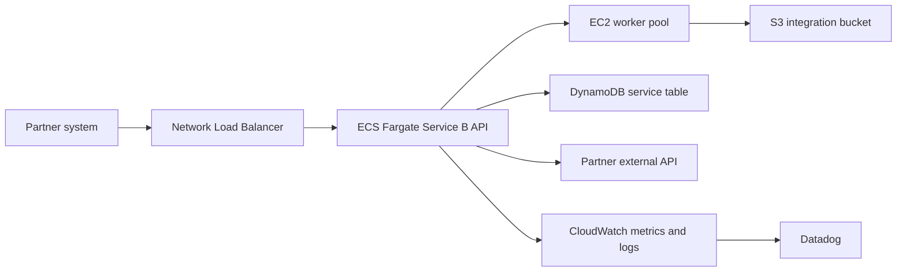

# Service B Communication Flow

This page keeps the Service B request path readable and logical. Refer to the draw.io diagram for VPC, subnet, and endpoint details.

Related account page: [`../docs/accounts/service-hosting-account-b.md`](../docs/accounts/service-hosting-account-b.md)



## Metadata

```yaml
owner_team: Platform Services
account_id: "222222222222"
environment: production
region: ap-northeast-1
source_diagram: ../diagrams/network/service-hosting-account-b.drawio
management_model: CDK-managed
updated_at: "2026-06-08"
```

